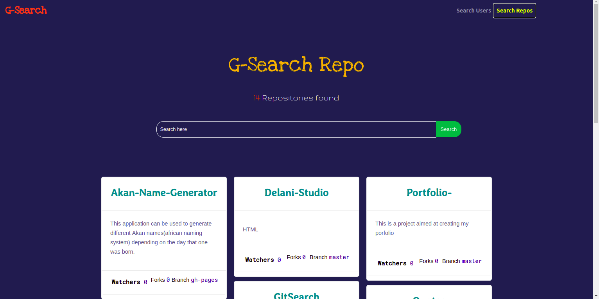

# GitSearch

This project was generated with [Angular CLI](https://github.com/angular/angular-cli) version 8.2.2.

## Author
> Antony k Mathenge
## Screenshots

## Installations
* nodejs
* npm
* angularCLI
* typescript

## Setup
Run ``https://github.com/ANTONYMATHENGE/GitSearch.git``

or download the zip file from github.

After extracting the files, run 

* 1  .`` cd gitSearch.`` 
* 2  .``ng serve.``

you can also run tests with ``ng test.``

## Technologies used
* Html5
* Css3
* Typescript
* Bootstrap
* Angular
* Github Api's

## BDD(Behaviour Driven Development)
| Inputs |  Description |
| :---         |          ---: |
| Username  | Github username, ``eg ANTONYMATHENGE``|

| Outputs |  Description |
| :---         |          ---: |
| Profile data  | A specific user profile info.|
| Repositories   |  All repositories created by a user |
|     |      |

## License
> MIT License &copy 2019 ANTONY

## Collaborate
To collaborate, reach me on [tonnykogi@gmail.com]()

## Further help

To get more help on the Angular CLI use `ng help` or go check out the [Angular CLI README](https://github.com/angular/angular-cli/blob/master/README.md).
